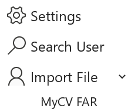
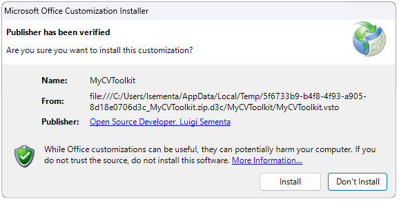

# MyCV-FAR

An Excel Add-in for creating the MyCV Users and Reviewers CSV import files for the annual FAR cycle. Validates BUIDs before creating the files.

Creates a menu on your **Home** tab in Excel:

---

## How to Install

1. **Download the MyCVToolkit ZIP File**  
   Click [here](https://github.com/lsementa/MyCV-FAR/releases) and select the latest release of the MyCVToolkit installation package.

2. **Extract the Contents**  
   Locate the downloaded ZIP file, extract its contents, and open the folder.

3. **Run the Installer**  
   Double-click on `Setup.exe` to start the installation process.  
   > **Note**: If Microsoft Defender SmartScreen appears, click **More Info** and then **Run Anyway** to proceed.

4. **Verification**  
   Verify the publisher has been verified and click install.

  

## How to Uninstall

1. **Open Add or Remove Programs**  
   On your Windows device, search for "Add or Remove Programs" in the Start menu.

2. **Find MyCVToolkit**  
   Scroll through the list or search for **MyCVToolkit**.

3. **Uninstall**  
   Select **MyCVToolkit**, click **Uninstall**, and follow the prompts to remove the application.
